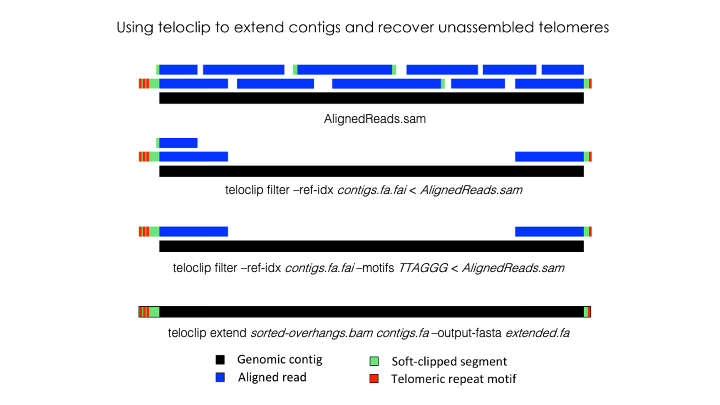

# teloclip

Find soft-clipped alignments containing unassembled telomeric repeats.

# Table of contents

* [About teloclip](#about-teloclip)
* [Options and usage](#options-and-usage)
    * [Installation](#installation)
    * [Example Usage](example-usage)
        * [Basic use case](basic-use-case)
        * [Example commands](example-commands)
        * [Optional Quality Control](optional-quality-control)
        * [Alternative use cases](alternative-use-cases)
    * [Options](teloclip-options)
* [Issues](issues)
* [License](#license)
* [Citing teloclip](citations)


## About teloclip

In most eukaryotic species, chromosomes terminate in repetitive [telomeric](https://en.wikipedia.org/wiki/Telomere) 
sequences. A complete genome assembly should ideally comprise chromosome-level contigs that possess telomeric 
repeats at each end. However, genome assemblers frequently fail to recover these repetitive features, instead 
producing contigs that terminate immediately prior to their location.

Teloclip is designed to recover long-reads that can be used to extend draft contigs and resolve missing telomeres 
(short-read alignments may also be processed with teloclip). It does this by searching alignments of raw 
long-read data (i.e. Pacbio or ONP reads mapped with Minimap2) for 'clipped' alignments that occur at the ends of 
draft contigs. A 'clipped' alignment is produced where the *end* of a read is not part of its best alignment. 
This can occur when a read extends past the end of an assembled contig.

Information about segments of a read that were aligned or clipped are stored in [SAM formatted](https://en.wikipedia.org/wiki/SAM_(file_format))
alignments as a [CIGAR string](https://www.drive5.com/usearch/manual/cigar.html). Teloclip parses these strings 
to determine if a read has been clipped at one or both ends of a contig. 

Optionally, teloclip can screen overhanging reads for telomere-associated motifs (i.e. 'TTAGGG' / 'CCCTAA')
and report only those containing a match.

Teloclip is based on concepts from Torsten Seemann's excellent tool [samclip](https://github.com/tseemann/samclip).
Samclip can be used to remove clipped alignments from a samfile prior to variant calling.


## Installation

Clone from this repository and install as a local Python package.

```bash
% git clone https://github.com/Adamtaranto/teloclip.git && cd teloclip && pip install -e .
```

Install from PyPi.

```bash
% pip install teloclip
```

Install from Bioconda.
```bash
% conda install -c bioconda teloclip
```

Test installation.

```bash
# Print version number and exit.
% teloclip --version
teloclip 0.0.1

# Get usage information
% teloclip --help
```

## Example Usage

### Basic use case



### Example commands 

First index the reference assembly
```
# Create index of reference fasta
% samtools faidx ref.fa
```

Reading alignments from SAM file
```
# Read input from file and write output to stout
% teloclip --ref ref.fa.fai in.sam

# Read input from stdin and write stdout to file
% teloclip --ref ref.fa.fai < in.sam > out.sam

# Filter alignments from BAM file, write sorted output to file
% samtools view -h in.bam | teloclip --ref ref.fa.fai | samtools sort > out.bam
```

Streaming SAM records from aligner
```
# Map PacBio long-reads to ref assembly, filter for alignments clipped at contig ends, write to sorted bam
% minimap2 -ax map-pb ref.fa pacbio.fq.gz | teloclip --ref ref.fa.fai | samtools sort > out.bam 

# Map reads, exclude unmapped reads and non-primary/supplementary alignments. Report clipped reads as sorted bam.
% minimap2 -ax map-pb ref.fa pacbio.fq.gz | samtools view -h -F 0x2308 | teloclip --ref ref.fa.fai | samtools sort > out.bam 

# Map long-reads with MiniMap2 and retain only reads which extend past a cotig end
# AND contain >=1 copy of the telomeric repeat "TTAGGG" (or its reverse complement "CCCTAA")
% minimap2 -ax map-pb ref.fa pacbio.fq.gz | teloclip --ref ref.fa.fai --motifs TTAGGG | samtools sort > out.bam 

```

### Optional Quality Control

**Additional filters**  

  - Consider pre-filtering alignments with "samtools view" to remove non-primary 
    / low quality alignments.
  - Users may wish to exclude reads below a minimum length or read quality score 
    to reduce the risk of incorrect alignments.
  - In some cases it may be useful to prioritise primary alignments that do not have the 
    secondary alignment "SA" tag set.

    ```
    # Exclude secondary alignments and primary alignments with SA tag set.
    % samtools view -h -F 0x2308 in.sam | awk '!/SA:/ {print $0;}' | teloclip --ref ref.fa.fai > noSA.sam 
    ```

**Pre-corrected Data**  

Users may find improved specificity of alignments using pre-corrected long-read data.
  
  - The genome assembler [Canu](https://github.com/marbl/canu) preforms pre-correction 
    of long-reads through iterative overlapping and correction prior to assembly.
    Corrected reads are trimmed based on coverage to remove low-confidence ends.
    The corrected reads are stored by Canu as *PREFIX.correctedReads.fasta.gz*, and 
    the trimmed corrected reads as *PREFIX.trimmedReads.fasta.gz*.
  - Single molecule long-reads can also be corrected with tools such as [LoRDEC](https://github.com/lanl001/halc) 
    or [HALC](http://www.atgc-montpellier.fr/lordec/).

Note: Long reads may loose ends containing telomeres as a result of trimming. Give it 
a go, try the raw reads if unsuccessful.
  
**Extending contigs**  

  - Before using terminal alignments identified by teloclip to extend contigs, 
    inspect alignments in a genome browser that displays information about clipped 
    reads, such as [IGV](https://github.com/igvteam/igv). Check for conflicting 
    clipped sequences.
  - After manually extending contigs the revised assembly should be re-polished 
    using available long and short read data to correct indels present in the raw 
    long-reads.
  - Validate the final assembly by re-mapping long-read data and checking for 
    alignments that extend into revised contig ends.

### Alternative use cases

**Illumina data**  

  - Teloclip will also work fine with aligned short read data, which has a far lower 
    error rate than single-molecule long-read data. However, there are obvious limits 
    to the distance that a contig may be extended with shorter reads.

**Hybridising existing assemblies**  
  
  - You may have assemblies for your genome generated with different assemblers/configurations
    or data types (i.e. 10X linked-reads, Illumina, PacBio, ONP) which vary in their success 
    in assembling individual telomeres. 
  - These alternative assemblies can be treated as long reads and aligned to a reference 
    using [Minimap2](https://github.com/lh3/minimap2). Teloclip will identify aligned contigs 
    that can be used to extend those in the reference set. 
  - Be cautious of short contigs that may align to may repetative sub-telomeric regions.

Align alternative assembly contigs to reference and report overhang alignments.
  ```
  % minimap2 -ax asm5 ref.fa asm.fa | samtools view -h -F 0x2308 | teloclip --ref ref.fa.fai | samtools sort > asm2ref.bam 
  ```
**Circularising Mitochondrial / Bacterial genomes**

  - Using default settings, teloclip will report alignments with clipped regions extending past 
    linear contig ends.
  - Reads can be extracted from these alignments using [circlator's bam2reads](https://github.com/sanger-pathogens/circlator/wiki/Task%3A-bam2reads) 
    and re-aligned to an assembly graph in [Bandage](https://github.com/rrwick/Bandage) to help 
    identify uncircularised contigs.

## Options

Run `teloclip --help` to view the programs' most commonly used options:

```
Usage: teloclip [-h] --refIdx REFIDX [--minClip MINCLIP] [--maxBreak MAXBREAK]
                [--motifs MOTIFS]
                [samfile]

Required:
 --refIdx REFIDX       Path to fai index for reference fasta. Index fasta using `samtools faidx FASTA`

Positional arguments:
  samfile               Input SAM can be added as the first positional argument after flagged options. 
                          If not set teloclip will read from stdin.

Optional:
  --minClip MINCLIP    Require clip to extend past ref contig end by at least N bases.
                         Default: 1
  --maxBreak MAXBREAK  Tolerate max N unaligned bases at contig ends. 
                         Default: 50
  --motifs MOTIFS      If set keep only reads containing given motif/s from a comma delimited list 
                         of strings. By default also search for reverse complement of motifs. 
                         i.e. TTAGGG,TTAAGGG will also match CCCTAA,CCCTTAA
                         Default: None
  --norev NOREV        If set do NOT search for reverse complement of specified motifs. 
                         Default: False
  --matchAny MATCHANY  If set motif match may occur in unclipped region of alignment.
                         Defaut: False
  --version            Show program's version number and exit.
```

## Issues

Submit feedback to the [Issue Tracker](https://github.com/Adamtaranto/teloclip/issues)

## License

Software provided under MIT license.

## Citations

*TBC*
