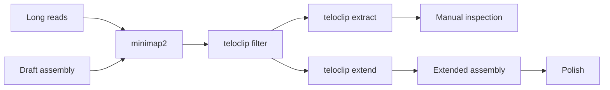

# Teloclip

Recover unassembled telomeres from raw long-reads using soft-clipped read
alignments.

## The problem

Genome assemblers are conservative at chromosome ends. Telomeric repeats are
short, highly repetitive and error-prone to sequence, so an assembler will
usually stop before it reaches the true end of a chromosome, leaving the
telomere out of the assembly.

The information is often still in your reads. A long read that starts inside the
assembled contig and continues past its end will align to the contig for part of
its length and then stop, with the remainder reported as a **soft clip**. That
clipped tail is sequence the assembler declined to place.

```
contig  ==========================================>|
read 1        ---------------------------->
read 2               ------------------------------>~~~~~~~~
read 3                    ------------------------->~~~~~~~~~~~~
                                          aligned  |  soft-clipped
```

If several reads are clipped at the same contig end and their clipped tails
contain telomeric repeats, that is good evidence the telomere is real and simply
missing from the assembly.

Teloclip finds those reads, and can splice their clipped tails onto the contig.

## The workflow



| Command | What it does |
|---|---|
| [`filter`](tutorial/filter.md) | Keeps only alignments soft-clipped at a contig end, optionally requiring telomeric motifs |
| [`extract`](tutorial/extract.md) | Writes the overhang reads to per-contig-end FASTA files for inspection |
| [`extend`](tutorial/extend.md) | Splices the best overhang onto each contig end and writes a new assembly |

## Where to start

- New to teloclip? Work through the [tutorial](tutorial/index.md).
- Want to understand what counts as an overhang? See
  [How overhangs are defined](guide/overhangs.md).
- Results look wrong? Start with
  [Biological cases that cause trouble](guide/biology.md).

!!! warning "Extended contigs are not polished"

    `extend` splices in sequence from a **single raw read**. Long reads carry
    indel errors, so the extension inherits them. Always re-polish the extended
    assembly with your long and short read data before downstream analysis.

## Citing

If teloclip is useful in your work, please cite it. See
[CITATION.cff](https://github.com/adamtaranto/teloclip/blob/main/CITATION.cff).
